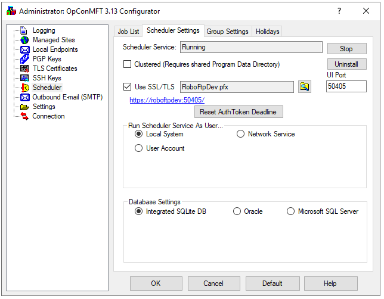
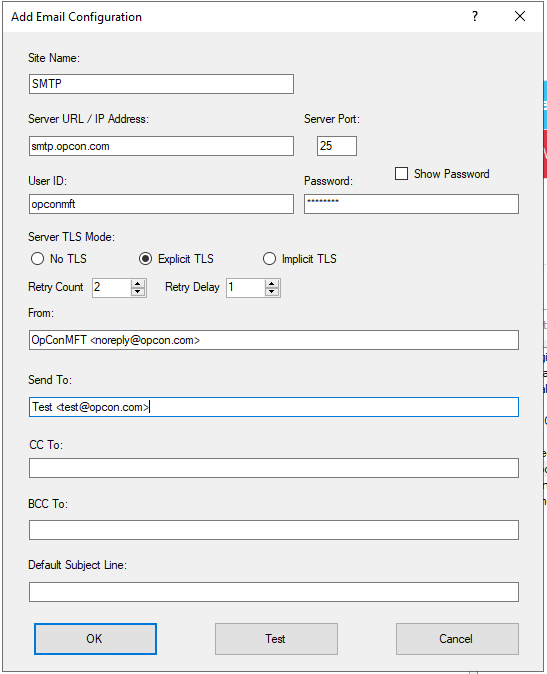
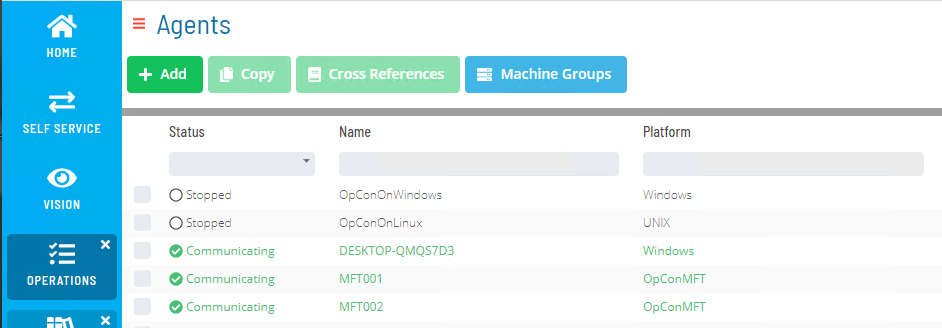
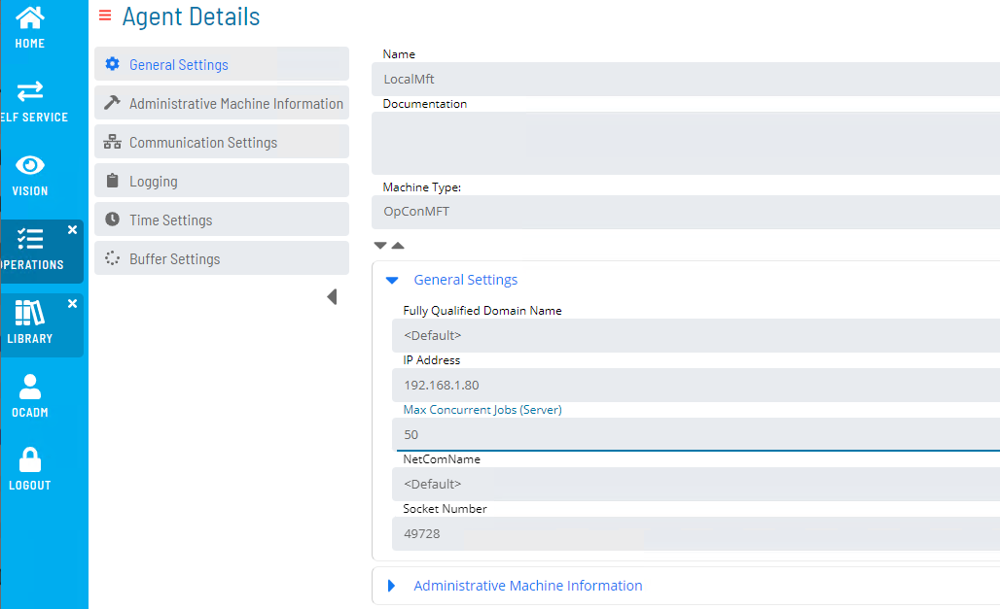

# MFT Agent Configuration

A port number for communication with OpCon is automatically configured during the installation process and can be found in the **Configurator**.

The **OpCon MFT Agent** does require a https connection. 

Using the **Configurator**, you can define a self-signed certificate or extract the information to request a certificate from a CA authority.

The **OpCon MFT Agent** can be configured to send notifications (emails). 

The configuration of the **OpCon MFT Agent** is done using **Solution Manager**.

