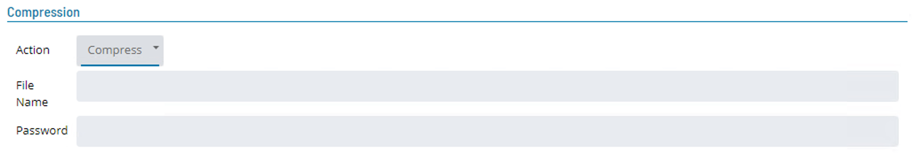
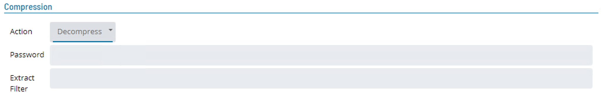

# Compression and Decompression

## Compression

This step will compress all files that match the **File Filter** specified in the **Source** section of the job into a single zip file.



* **File Name** ```(Optional)```
    * Defines the name of the zip file to create.
    :::info Note
    If no name is specified, the compress step will name the zip the same as the first file that is part of the zip.
    :::
* **Password** ```(Optional)```
    * Definition that defines a password that can be added to the compressed file.

## Decompression

This step will decompressthe compressed file set that match the **File Filter** specified in the **Source** section of the job into a single zip file. You can also specifiy to decrypt a single that is contained in a compressed file set.



* **Password** ```(Optional)```
    * Defines a password that must be used to decompress the file.
* **Extract Filter**
    * The compressed file could contain multiple files and it is therefore possible to only require specific files within the compressed file. 
    * Use an asterick ( \* ) to extract all files or specific files by defining a file type using wild cards. 
    * Multiple types can be entered using the pipe ( | ).