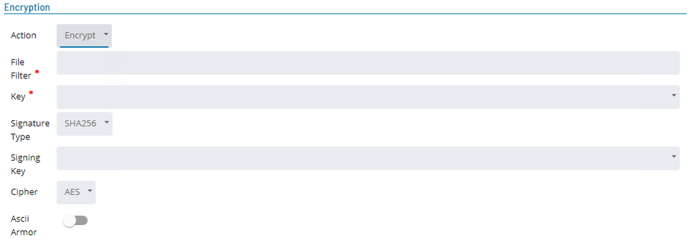
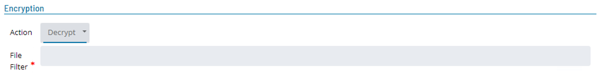

# Encryption and Decryption

## Encryption

This step will encrypt all files that match the **File Filter** specified in the **Source** section with a specific PGP public key.The encrypted output files are named by adding a .pgp extension to the source file name.

* **File Filter**
    * This defines the files of the file set to be included in encrypted file. 
    * It supports wild cards ( ? ) and ( \* ) as well as multiple definitions seperated by the pipe ( | ) character (Example: \*.dt1|\*.dt2).
    * When requiring all files in the file set an asterick ( \* ) should be used instead of asterick dot asterick ( \*.\* ) as the second definition will only select files that have a name and and extension.
* **Key**
    * Unique identifier of the public key used for encryption. Select the key name from the dropdown list.
* **Signature Type**
    * The encoding type used to encode the Signing Key. 
    * Select the encoding type from the dropdown list.
    * Values: MD5, RIPE160, SHA1, SHA256, SHA512, SHA3 - 256, SHA3 - 512. 
    * Default: SHA256
* **Signing Key**
    * Digital signature enabling the recipient of the file to verify the authenticity of the information's origin, and also verify that the information has not been tampered with. 
* **Cipher**
    * Select the symmetric cipher to be used to encrypt the file set from the dropdown list
    * Values: CAST5, AES, AES192, IDEA, Blowfish, Twofish, 3DES.
    * Default: AES
* **Ascii Armor**
    * Indicates whether the encrypted representation of a file should consist entirely of printable ASCII characters 
    * Values: True or false
    * Default: False

## Decryption

The decrypt step decrypts PGP or GPG encrypted source files in the current file set. 

* **File Filter**
    * This defines the files of the file set to be decrypted. 
    * It supports wild cards ( ? ) and ( \* ) as well as multiple definitions separated by the pipe ( | ) character (Example: \*.dt1|\*.dt2). 
    * When requiring all files in the file set a single asterick ( \* ) should be used instead of asterick dot asterick ( \*.\* ) as the second definition will only select files that have a name and and extension.

