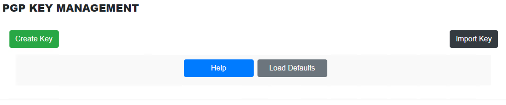
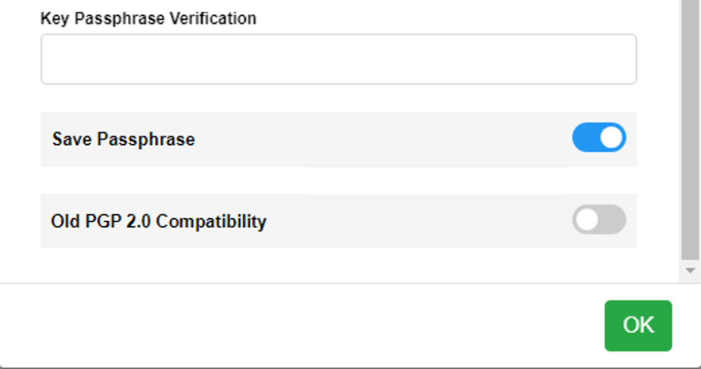

# Encryption Keys



The following functionality is provided by the OpCon MFT Configurator:

*   The creation of private and public key(s).
*   The ability to export public keys to ASCII armored and non-ASCII armored files. ASCII armored key files are plain-text files; non-armored files are in a binary format. Exported public key files are signed by the matching private key, if it is available.
*   The ability to export public and private key pairs to be shared with other applications that need to access your pgp encrypted files. The private key will still be encrypted with its passphrase.
*   The ability to import key(s)
*   The ability to delete key(s)

## Create a Key

Keys are created in the OpCon MFT Settings within the Agent congifuration.


*   **Key User Name** ```Required```
    * The name that will be assigned to this key-pair consisting of alphanumeric characters.
*   **Key Comment**
    * Comment associated with the definition.
*   **Key E-Mail Address**
    * Email address associated with the definition.
*   **Key Algorithm**
    * Select the encryption algorithm (RSA, DSA(DH/DSS)).
*   **Key Size**
    * Select the encryption key size (4096, 2048, 1024).
*   **Key Expires**
    * Select Never or enter an expiration date.
*   **Key PassPhrase**	
    * Define a Passphrase.



*   **Key PassPhrase Verification**
    * Re-enter the Passphrase for verification.
*   **Save PassPhrase**	
    * Select Save Passphrase to store it in the encrypted password store for use for automatic use with OpCon MFT PGP commands.
