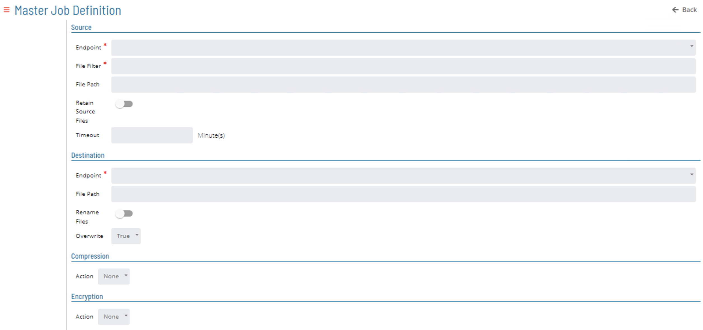
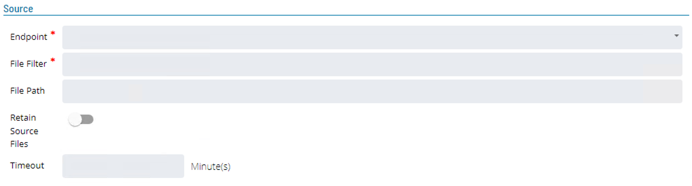

# MFT Job Type

The **MFT Master Job Definition** screen is broken down into four sections:

* Source
* Destination
* Compression
* Encrytion 



## Source Section



* **Endpoint** (```Required```)
    * This defines which endpoint to use to retrieve the file set.
* **File Filter** (```Required```)
    * This defines the files to be included in the file set.
    * It supports both the question mark ( ? ) and asterick ( \* ) wild cards. 
    * Specify multiple files with a pipe ( | ) character (Example: \*.csv|*.xls).
    
:::info Note
When requiring all files in the directory the definition an asterick ( \* ) should be used instead of asterick dot asterick ( \*.\* ) as the second definition will only select files that have a name and and extension.
:::

* **File Path**
    * This defines the path to check for files to add to the file set.
* **Timeout**
    * Indicates how many minutes the get step should wait for the source files if no files are present when the task starts 
    * Default value is 1 minute.
* **Retain Source Files**
    * Indicates if the source files associated with the get step should be removed after the file set is created.

## Destination Section


* **Endpoint** (```Required```)
    * Defines the endpoint to use defining where to place the file set. 
* **File Path**
    * Defines the path where the files should be placed.
* **Rename Files** (```Toggle```)
    * **Search Pattern**
        * Consists of a regex string indicating what to search for in the file name. This field works in conjuction with the Replace Pattern field when renaming the file.
    * **Replace Pattern**
        * This field consists of a Regex string indicating what the replacement text should be if a match is found. This field works with the Search Pattern field.
* **Overwrite**
    * Select what should happen if the destination files associated with the put step already exist 
    * Values True, Append, or False. Default is  True.
