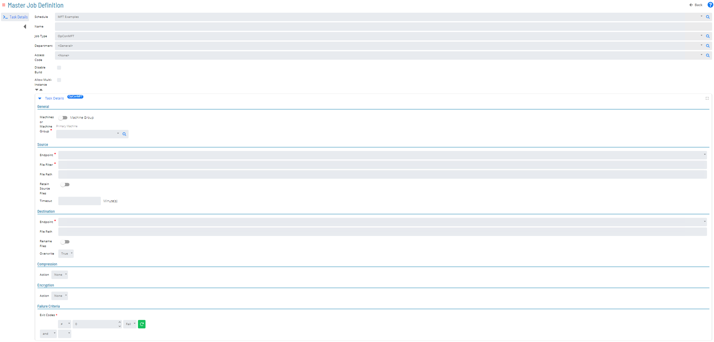

# MFT Agent Overview

###	MFT Agent 
*	Should always be installed within a secure zone as it contains sensitive information like:
    *	site credentials
    *	TLS, SSH, and PGP keys
    *	Certificates
*	Uses standard FTP Calls
    *	GET
    *	POST
    *	PUT
    *	COMPRESSION
    *	ENCRYPTION
*	SAM submits task to the Agent via a new NetCom Proxy called **SMAMftAgentProxy**
*	Utilizes tokens generated by the agent to secure communications
