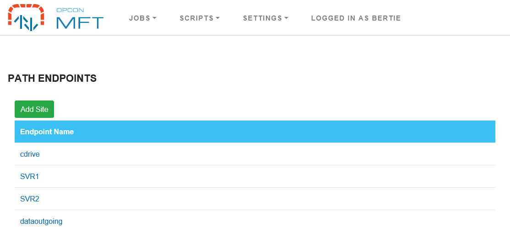
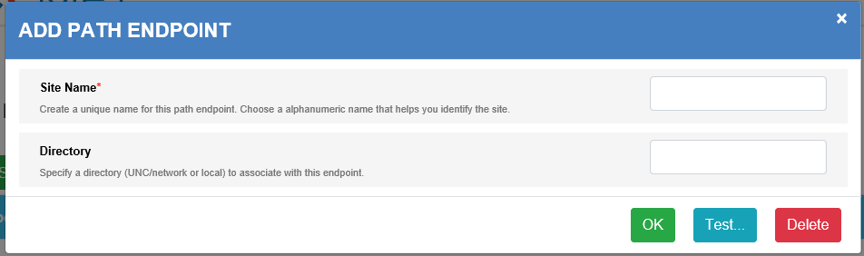

# Path Endpoints

A **Path Endpoint** is defined as either a UNC path, ```\\<server>\<directory>``` or as a local path that includes the drive letter, ```<drive letter>:\<directory>```.





* **Site Name** (```Required```)
    * Used to identify the endpoint. 
* **Directory** (```Required```)
    * Defines the location where the data can be retrieved or placed. 
    * This value can be a UNC path or drive path. 
    * This value forms the initial portion of the location and any values entered in the **File Path** definition of the **Source** or **Destination** sections during task definition will be appended to this value. 


