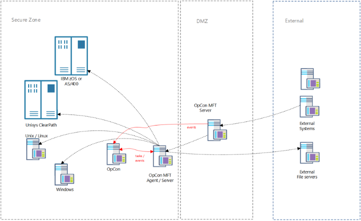

# Overview

*   The **MFT Agent** is two solutions delivered in one component:
    *   MFT Agent
    *	MFT Server

### MFT Agent

*   MFT Agent provides B2B capbilities, which are used to push files/data out to and pull files/data from servers.
*   MFT Agent executes tasks that are pushed to it and returns information pertaining to that task back to OpCon.

### MFT Server

*   MFT Server submits events to OpCon that are triggered by **...**

:::info Note
To use either the MFTAgent and MFTServer, a new license will need to be requested prior to configuration.
:::

:::info Note
The MFT Agent/Server screens are ONLY available via Solution Manager.
:::